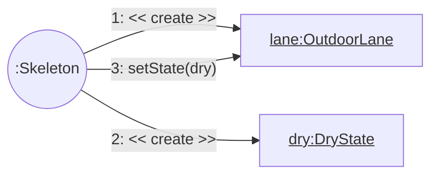

```mermaid 
graph LR
    SK((:Skeleton))
    OL[<u>lane:OutdoorLane</u>]
    DS[<u>dry:DryState</u>]

    SK -- "1: << create >>" --> OL
    SK -- "2: << create >>" --> DS
    SK -- "3: setState(dry)" --> OL
```
