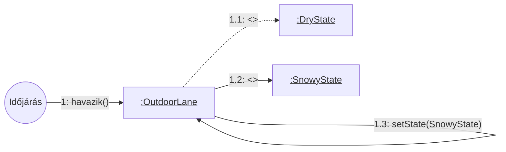

```mermaid 
graph LR
    A((Időjárás))
    Lane[<u>:OutdoorLane</u>]
    Dry[<u>:DryState</u>]
    Snowy[<u>:SnowyState</u>]

    A -- "1: havazik()" --> Lane
    Lane -. "1.1: <<megszüntet>>" .-> Dry
    Lane -- "1.2: <<létrehoz>>" --> Snowy
    Lane -- "1.3: setState(SnowyState)" --> Lane
```
