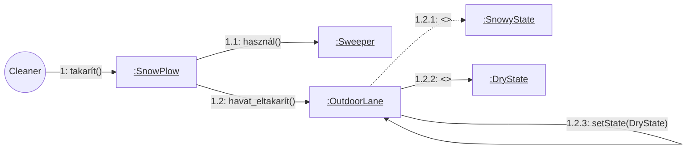

```mermaid
graph LR
    C((Cleaner))
    SP[<u>:SnowPlow</u>]
    SW[<u>:Sweeper</u>]
    OL[<u>:OutdoorLane</u>]
    SN[<u>:SnowyState</u>]
    DR[<u>:DryState</u>]

    C -- "1: takarít()" --> SP
    SP -- "1.1: használ()" --> SW
    SP -- "1.2: havat_eltakarít()" --> OL
    OL -. "1.2.1: <<megszüntet>>" .-> SN
    OL -- "1.2.2: <<létrehoz>>" --> DR
    OL -- "1.2.3: setState(DryState)" --> OL
```
