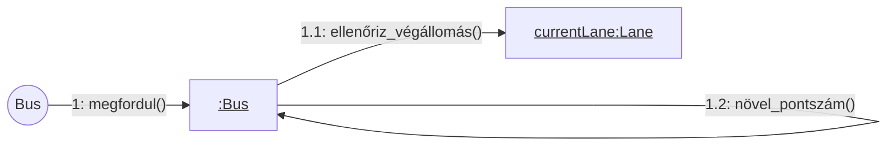

```mermaid
graph LR
    A((Bus))
    B[<u>:Bus</u>]
    L[<u>currentLane:Lane</u>]

    A -- "1: megfordul()" --> B
    B -- "1.1: ellenőriz_végállomás()" --> L
    B -- "1.2: növel_pontszám()" --> B
```
