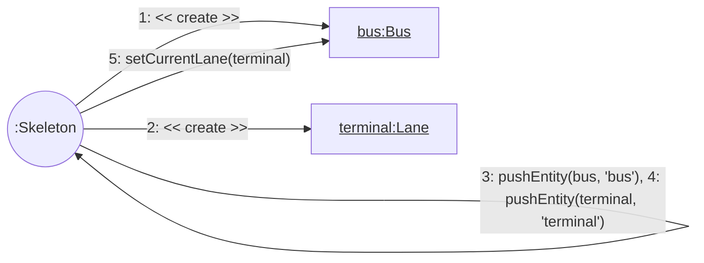

```mermaid
graph LR
    SK((:Skeleton))
    B[<u>bus:Bus</u>]
    L[<u>terminal:Lane</u>]

    SK -- "1: << create >>" --> B
    SK -- "2: << create >>" --> L
    SK -- "3: pushEntity(bus, 'bus'), 4: pushEntity(terminal, 'terminal')" --> SK
    
    SK -- "5: setCurrentLane(terminal)" --> B
```
