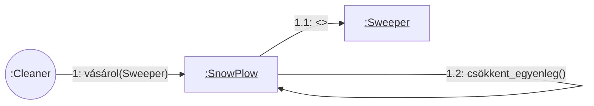

```mermaid
graph LR
    C((:Cleaner))
    SP[<u>:SnowPlow</u>]
    SW[<u>:Sweeper</u>]

    C -- "1: vásárol(Sweeper)" --> SP
    SP -- "1.1: <<létrehoz>>" --> SW
    SP -- "1.2: csökkent_egyenleg()" --> SP
```
