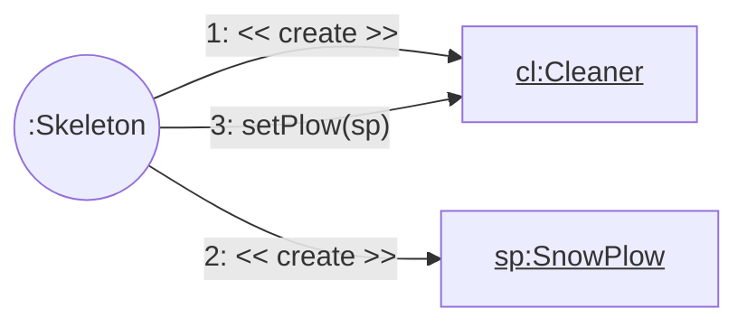

```mermaid
graph LR
    SK((:Skeleton))
    CL[<u>cl:Cleaner</u>]
    SP[<u>sp:SnowPlow</u>]

    SK -- "1: << create >>" --> CL
    SK -- "2: << create >>" --> SP
    
    SK -- "3: setPlow(sp)" --> CL
```
