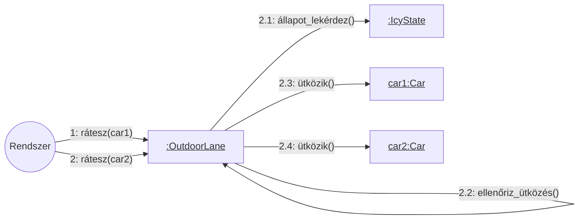

```mermaid
graph LR
    S((Rendszer))
    OL[<u>:OutdoorLane</u>]
    IS[<u>:IcyState</u>]
    C1[<u>car1:Car</u>]
    C2[<u>car2:Car</u>]

    S -- "1: rátesz(car1)" --> OL
    S -- "2: rátesz(car2)" --> OL
    OL -- "2.1: állapot_lekérdez()" --> IS
    OL -- "2.2: ellenőriz_ütközés()" --> OL
    OL -- "2.3: ütközik()" --> C1
    OL -- "2.4: ütközik()" --> C2
```
