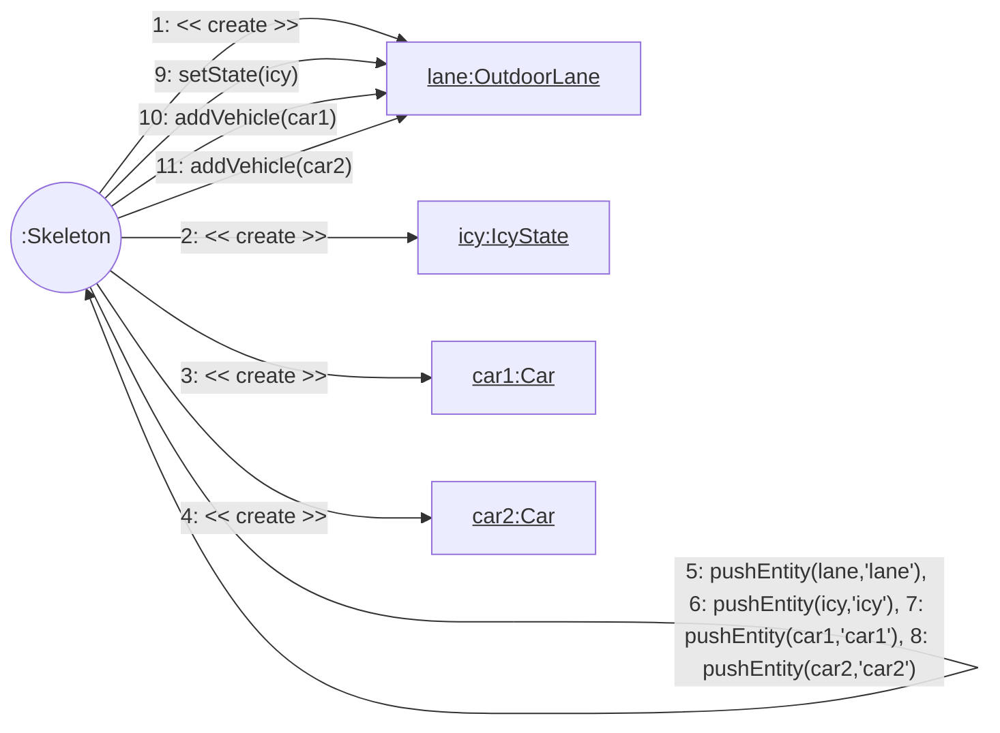

```mermaid
graph LR
    SK((:Skeleton))
    OL[<u>lane:OutdoorLane</u>]
    IS[<u>icy:IcyState</u>]
    C1[<u>car1:Car</u>]
    C2[<u>car2:Car</u>]

    SK -- "1: << create >>" --> OL
    SK -- "2: << create >>" --> IS
    SK -- "3: << create >>" --> C1
    SK -- "4: << create >>" --> C2
    SK -- "5: pushEntity(lane,'lane'), 6: pushEntity(icy,'icy'), 7: pushEntity(car1,'car1'), 8: pushEntity(car2,'car2')" --> SK

    SK -- "9: setState(icy)" --> OL
    SK -- "10: addVehicle(car1)" --> OL
    SK -- "11: addVehicle(car2)" --> OL
```
