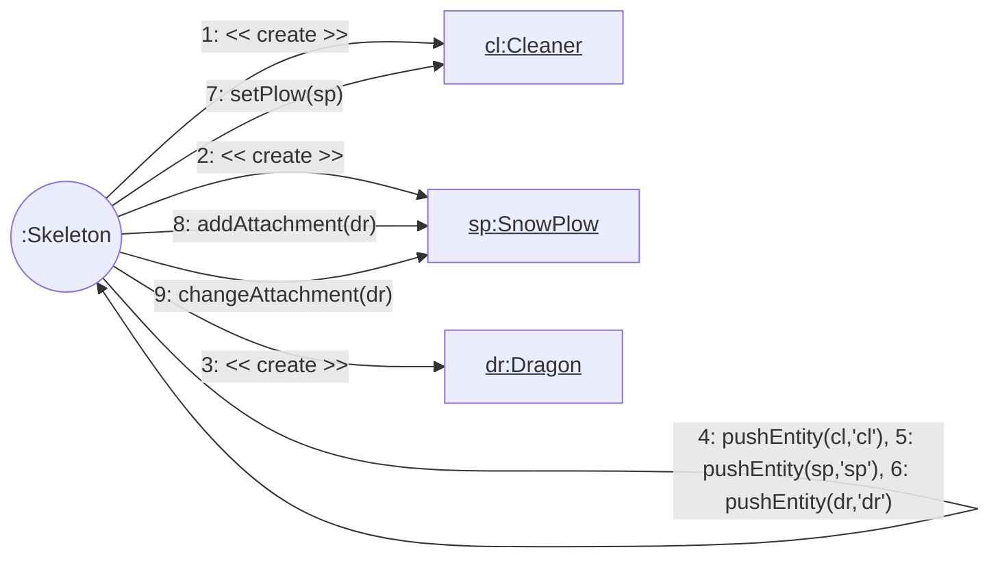

```mermaid
graph LR
    SK((:Skeleton))
    CL[<u>cl:Cleaner</u>]
    SP[<u>sp:SnowPlow</u>]
    DR[<u>dr:Dragon</u>]

    SK -- "1: << create >>" --> CL
    SK -- "2: << create >>" --> SP
    SK -- "3: << create >>" --> DR
    SK -- "4: pushEntity(cl,'cl'), 5: pushEntity(sp,'sp'), 6: pushEntity(dr,'dr')" --> SK

    SK -- "7: setPlow(sp)" --> CL
    SK -- "8: addAttachment(dr)" --> SP
    SK -- "9: changeAttachment(dr)" --> SP
```
