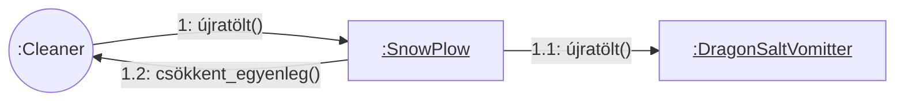

```mermaid
graph LR
    C((:Cleaner))
    SP[<u>:SnowPlow</u>]
    DSV[<u>:DragonSaltVomitter</u>]

    C -- "1: újratölt()" --> SP
    SP -- "1.1: újratölt()" --> DSV
    SP -- "1.2: csökkent_egyenleg()" --> C
```
