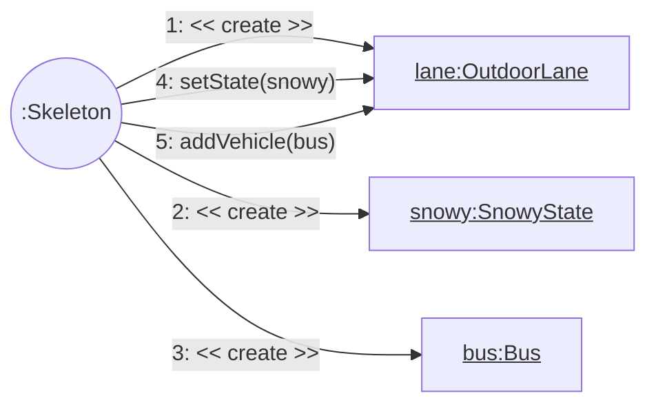

```mermaid
graph LR
    SK((:Skeleton))
    OL[<u>lane:OutdoorLane</u>]
    SN[<u>snowy:SnowyState</u>]
    B[<u>bus:Bus</u>]

    SK -- "1: << create >>" --> OL
    SK -- "2: << create >>" --> SN
    SK -- "3: << create >>" --> B

    SK -- "4: setState(snowy)" --> OL
    SK -- "5: addVehicle(bus)" --> OL
```
