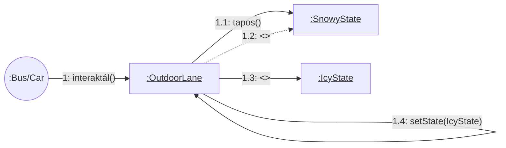

```mermaid
graph LR
    V((:Bus/Car))
    OL[<u>:OutdoorLane</u>]
    SN[<u>:SnowyState</u>]
    IC[<u>:IcyState</u>]

    V -- "1: interaktál()" --> OL
    OL -- "1.1: tapos()" --> SN
    OL -. "1.2: <<megszüntet>>" .-> SN
    OL -- "1.3: <<létrehoz>>" --> IC
    OL -- "1.4: setState(IcyState)" --> OL
```
