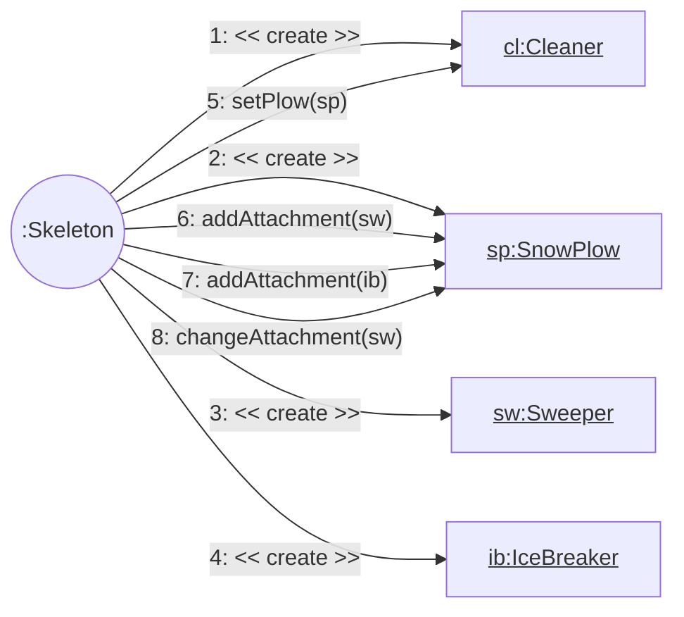

```mermaid
graph LR
    SK((:Skeleton))
    CL[<u>cl:Cleaner</u>]
    SP[<u>sp:SnowPlow</u>]
    SW[<u>sw:Sweeper</u>]
    IB[<u>ib:IceBreaker</u>]

    SK -- "1: << create >>" --> CL
    SK -- "2: << create >>" --> SP
    SK -- "3: << create >>" --> SW
    SK -- "4: << create >>" --> IB

    SK -- "5: setPlow(sp)" --> CL
    SK -- "6: addAttachment(sw)" --> SP
    SK -- "7: addAttachment(ib)" --> SP
    SK -- "8: changeAttachment(sw)" --> SP
```
