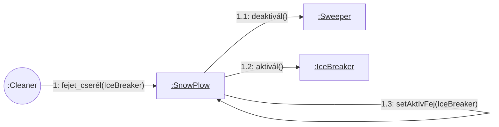

```mermaid
graph LR
    C((:Cleaner))
    SP[<u>:SnowPlow</u>]
    SW[<u>:Sweeper</u>]
    IB[<u>:IceBreaker</u>]

    C -- "1: fejet_cserél(IceBreaker)" --> SP
    SP -- "1.1: deaktivál()" --> SW
    SP -- "1.2: aktivál()" --> IB
    SP -- "1.3: setAktívFej(IceBreaker)" --> SP
```
