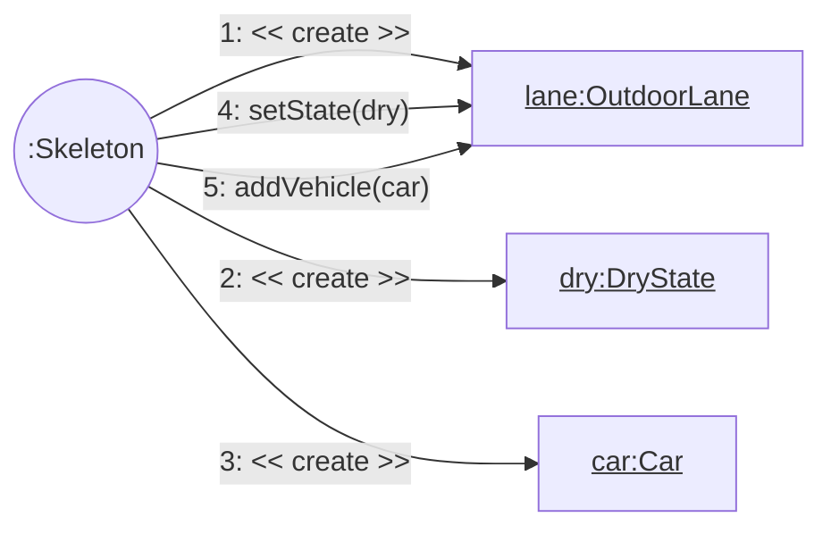

```mermaid
graph LR
    SK((:Skeleton))
    OL[<u>lane:OutdoorLane</u>]
    DS[<u>dry:DryState</u>]
    C[<u>car:Car</u>]

    SK -- "1: << create >>" --> OL
    SK -- "2: << create >>" --> DS
    SK -- "3: << create >>" --> C

    SK -- "4: setState(dry)" --> OL
    SK -- "5: addVehicle(car)" --> OL
```
