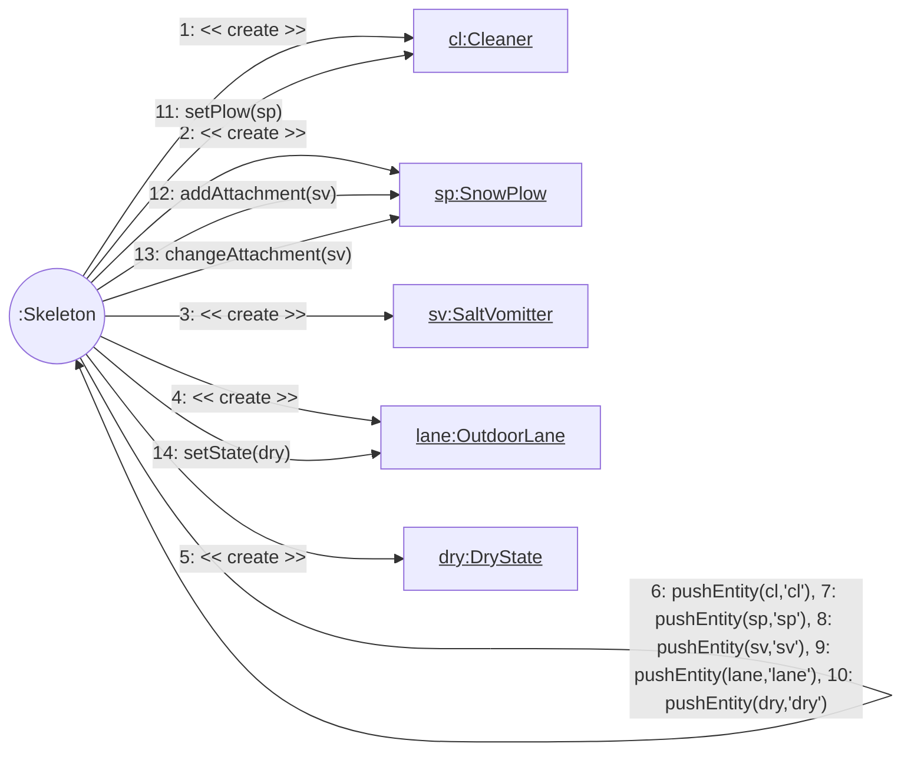

```mermaid
graph LR
    SK((:Skeleton))
    CL[<u>cl:Cleaner</u>]
    SP[<u>sp:SnowPlow</u>]
    SV[<u>sv:SaltVomitter</u>]
    OL[<u>lane:OutdoorLane</u>]
    DS[<u>dry:DryState</u>]

    SK -- "1: << create >>" --> CL
    SK -- "2: << create >>" --> SP
    SK -- "3: << create >>" --> SV
    SK -- "4: << create >>" --> OL
    SK -- "5: << create >>" --> DS
    SK -- "6: pushEntity(cl,'cl'), 7: pushEntity(sp,'sp'), 8: pushEntity(sv,'sv'), 9: pushEntity(lane,'lane'), 10: pushEntity(dry,'dry')" --> SK

    SK -- "11: setPlow(sp)" --> CL
    SK -- "12: addAttachment(sv)" --> SP
    SK -- "13: changeAttachment(sv)" --> SP
    SK -- "14: setState(dry)" --> OL
```
