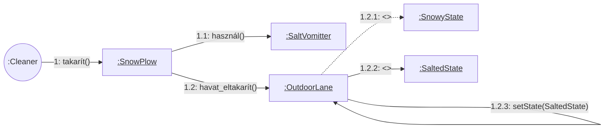

```mermaid
graph LR
    C((:Cleaner))
    SP[<u>:SnowPlow</u>]
    SV[<u>:SaltVomitter</u>]
    OL[<u>:OutdoorLane</u>]
    SN[<u>:SnowyState</u>]
    SS[<u>:SaltedState</u>]

    C -- "1: takarít()" --> SP
    SP -- "1.1: használ()" --> SV
    SP -- "1.2: havat_eltakarít()" --> OL
    OL -. "1.2.1: <<megszüntet>>" .-> SN
    OL -- "1.2.2: <<létrehoz>>" --> SS
    OL -- "1.2.3: setState(SaltedState)" --> OL
```
