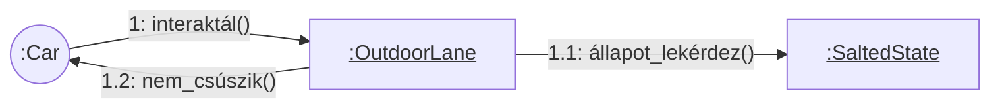

```mermaid
graph LR
    V((:Car))
    OL[<u>:OutdoorLane</u>]
    SS[<u>:SaltedState</u>]

    V -- "1: interaktál()" --> OL
    OL -- "1.1: állapot_lekérdez()" --> SS
    OL -- "1.2: nem_csúszik()" --> V
```
