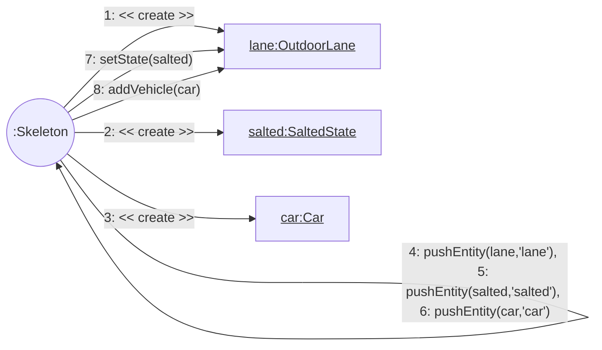

```mermaid
graph LR
    SK((:Skeleton))
    OL[<u>lane:OutdoorLane</u>]
    SS[<u>salted:SaltedState</u>]
    C[<u>car:Car</u>]

    SK -- "1: << create >>" --> OL
    SK -- "2: << create >>" --> SS
    SK -- "3: << create >>" --> C
    
    SK -- "4: pushEntity(lane,'lane'), 5: pushEntity(salted,'salted'), 6: pushEntity(car,'car')" --> SK

    SK -- "7: setState(salted)" --> OL
    SK -- "8: addVehicle(car)" --> OL
```
