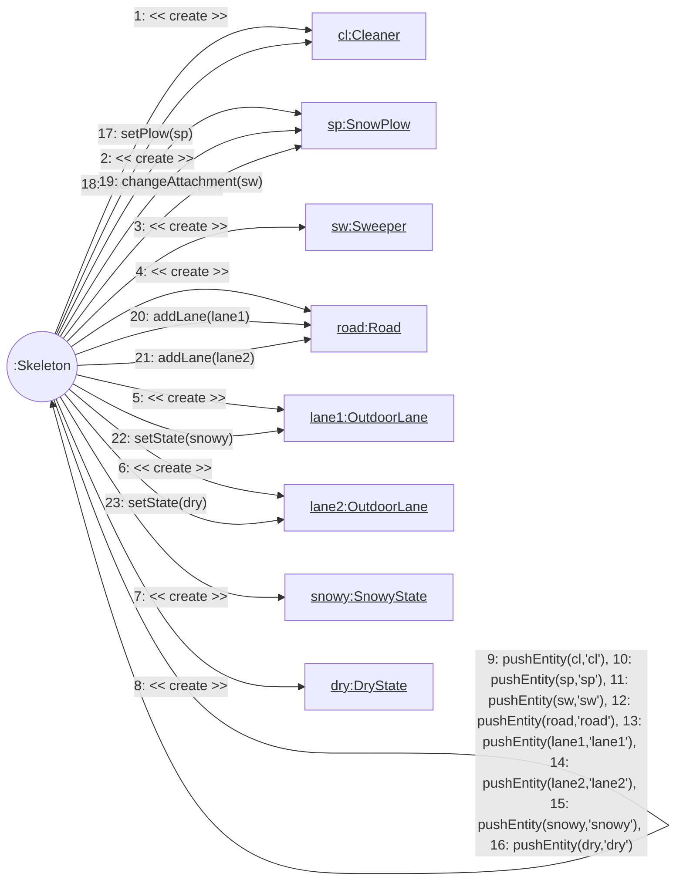

```mermaid
graph LR
    SK((:Skeleton))
    CL[<u>cl:Cleaner</u>]
    SP[<u>sp:SnowPlow</u>]
    SW[<u>sw:Sweeper</u>]
    R[<u>road:Road</u>]
    OL1[<u>lane1:OutdoorLane</u>]
    OL2[<u>lane2:OutdoorLane</u>]
    SN[<u>snowy:SnowyState</u>]
    DS[<u>dry:DryState</u>]

    SK -- "1: << create >>" --> CL
    SK -- "2: << create >>" --> SP
    SK -- "3: << create >>" --> SW
    SK -- "4: << create >>" --> R
    SK -- "5: << create >>" --> OL1
    SK -- "6: << create >>" --> OL2
    SK -- "7: << create >>" --> SN
    SK -- "8: << create >>" --> DS

    SK -- "9: pushEntity(cl,'cl'), 10: pushEntity(sp,'sp'), 11: pushEntity(sw,'sw'), 12: pushEntity(road,'road'), 13: pushEntity(lane1,'lane1'), 14: pushEntity(lane2,'lane2'), 15: pushEntity(snowy,'snowy'), 16: pushEntity(dry,'dry')" --> SK

    SK -- "17: setPlow(sp)" --> CL
    SK -- "18: addAttachment(sw)" --> SP
    SK -- "19: changeAttachment(sw)" --> SP
    SK -- "20: addLane(lane1)" --> R
    SK -- "21: addLane(lane2)" --> R
    SK -- "22: setState(snowy)" --> OL1
    SK -- "23: setState(dry)" --> OL2
```
