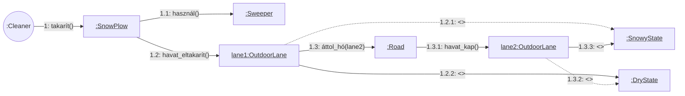

```mermaid
graph LR
    C((:Cleaner))
    SP[<u>:SnowPlow</u>]
    SW[<u>:Sweeper</u>]
    L1[<u>lane1:OutdoorLane</u>]
    L2[<u>lane2:OutdoorLane</u>]
    RD[<u>:Road</u>]
    SN[<u>:SnowyState</u>]
    DR[<u>:DryState</u>]

    C -- "1: takarít()" --> SP
    SP -- "1.1: használ()" --> SW
    SP -- "1.2: havat_eltakarít()" --> L1
    L1 -. "1.2.1: <<megszüntet>>" .-> SN
    L1 -- "1.2.2: <<létrehoz>>" --> DR
    L1 -- "1.3: áttol_hó(lane2)" --> RD
    RD -- "1.3.1: havat_kap()" --> L2
    L2 -. "1.3.2: <<megszüntet>>" .-> DR
    L2 -- "1.3.3: <<létrehoz>>" --> SN
```
