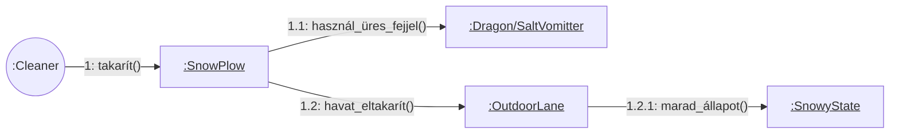

```mermaid
graph LR
    C((:Cleaner))
    SP[<u>:SnowPlow</u>]
    DSV[<u>:Dragon/SaltVomitter</u>]
    OL[<u>:OutdoorLane</u>]
    SN[<u>:SnowyState</u>]

    C -- "1: takarít()" --> SP
    SP -- "1.1: használ_üres_fejjel()" --> DSV
    SP -- "1.2: havat_eltakarít()" --> OL
    OL -- "1.2.1: marad_állapot()" --> SN
```
